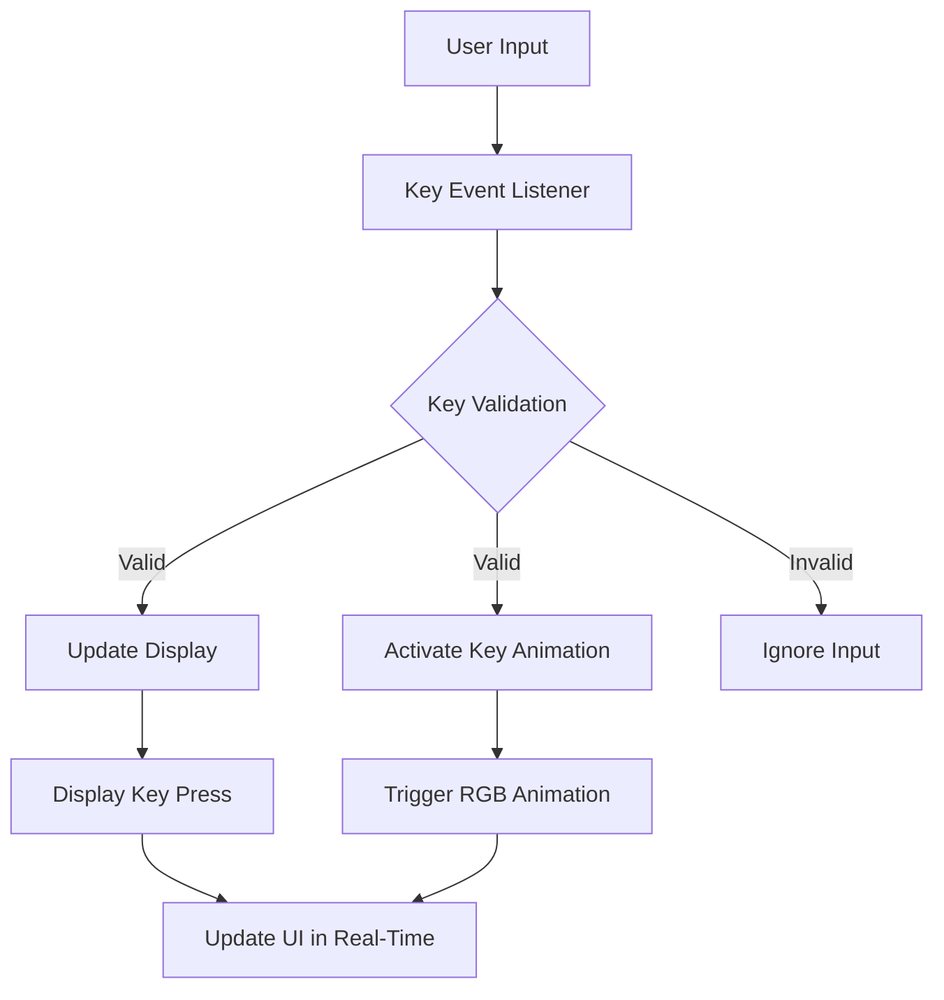

# Keyboard Project


## Overview
This project is focused on developing a custom keyboard interface that mimics the look and feel of a real keyboard, complete with RGB animations, keypress handling, and a display for showing keypress events.

## Features
- Realistic keyboard layout with responsive keys.
- RGB lighting with gradient animations for a visually appealing experience.
- Real-time display of key presses.
- Cross-browser compatibility and responsive design.
- Dynamic updates based on physical keyboard input and mouse clicks.

## Installation
To run this project locally, follow these steps:

1. **Clone the repository**
    ```bash
    git clone https://github.com/bniladridas/dynamic-rgb-keyboard.git
    ```

2. **Navigate to the project directory**
    ```bash
    cd dynamic-rgb-keyboard
    ```

3. **Install dependencies**
    ```bash
    npm install
    ```

4. **Build the project**
    ```bash
    npm run build
    ```

5. **Start the development server**
    ```bash
    npm start
    ```

6. Open your browser and navigate to `http://localhost:3000` to view the project.

## Usage
1. Open the application in your browser.
2. Press keys on your physical keyboard or click keys on the virtual keyboard to see real-time updates.
3. Enjoy the RGB effects and the keypress display functionality.

## System Design
The following structure explains how data is stored and fetched using Mermaid for visualization:



- **User Input**: Captures keypresses or clicks.
- **Key Event Listener**: Listens for events triggered by the user.
- **Key Validation**: Ensures the input is valid (e.g., part of the keyboard layout).
- **Update Display**: Displays the pressed key.
- **Activate Key Animation**: Highlights the pressed key with animations.
- **Ignore Input**: Ignores invalid inputs (e.g., unrecognized keys).
- **Update UI in Real-Time**: Ensures the interface remains responsive.

## License
This project is licensed under the MIT License.
